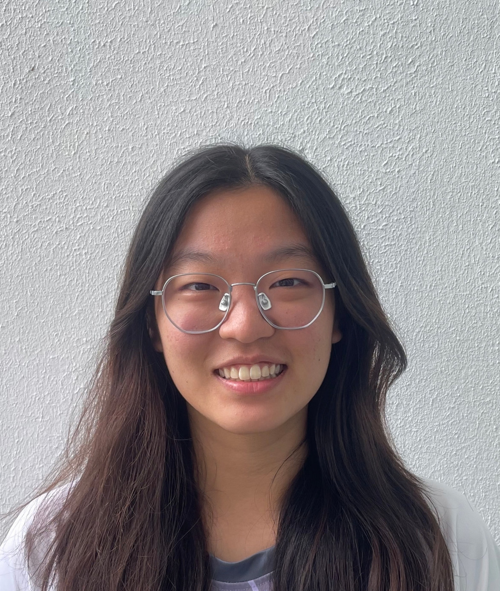
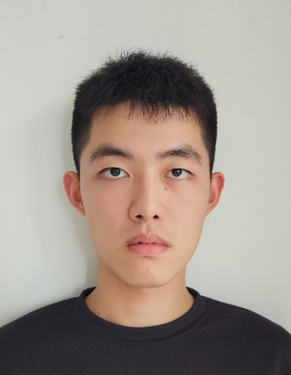

We are a team based in the [School of Computing, National University of Singapore](https://www.comp.nus.edu.sg).

You can reach us at the email `seer[at]comp.nus.edu.sg`

## Project team

### Roger Zhang

[[homepage](http://rogerzhang888.github.io)]
[[github](https://github.com/rogerzhang888)]
[[portfolio](team/rogerzhang888.md)]

* Role: Project Advisor

### Jane Doe

[[github](http://github.com/johndoe)]
[[portfolio](team/johndoe.md)]

* Role: Team Lead
* Responsibilities: UI

### Sarah Chau

[[github](https://github.com/chausarahnusitems-tech)]

* Role: Product Manager
* Responsibilities: Data and User Research

### Praneeth Suresh

[[github](http://github.com/Praneeth-Suresh)]
[[homepage](https://notes.praneeth-suresh-s.workers.dev/)]

* Role: Developer
* Responsibilities: Dev Ops + Threading

### James Doe

[[github](http://github.com/jiahw4ng)]
[[portfolio](team/jiahw4ng.md)]

* Role: Developer
* Responsibilities: UI
