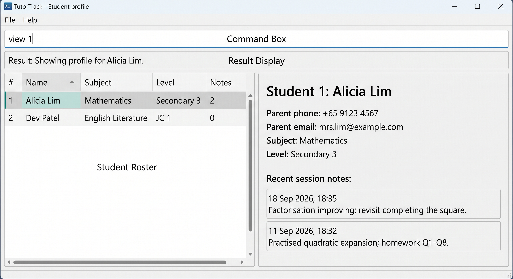

AddressBook Level 3 (AB3) is a **desktop application for managing contacts, optimized for use through a Command Line Interface (CLI)** while retaining the benefits of a Graphical User Interface (GUI). If you type quickly, AB3 can help you manage contacts faster than traditional GUI applications.

* Table of Contents
{:toc}

--------------------------------------------------------------------------------------------------------------------

## Quick start

1. Ensure that Java `25` or later is installed on your computer. 
   **Mac users:** Ensure you have the precise JDK version prescribed [here](https://se-education.org/guides/tutorials/javaInstallationMac.html).

1. Download the latest `.jar` file from [here](https://github.com/se-edu/addressbook-level3/releases).

1. Copy the file to the folder you want to use as the _home folder_ for your AddressBook.

1. Open a terminal, `cd` to the folder containing the JAR file, and run `java -jar addressbook.jar`. 
   A GUI similar to the one below should appear in a few seconds. Note how the app contains some sample data. 
   

1. Type a command in the command box and press Enter to execute it. For example, type **`help`** and press Enter to open the help window. 
   Some example commands you can try:

   * `list` : Lists all contacts.

   * `add n/John Doe p/98765432 e/johnd@example.com a/John street, block 123, #01-01` : Adds a contact named `John Doe` to the Address Book.

   * `delete 3` : Deletes the 3rd contact shown in the current list.

   * `clear` : Deletes all contacts.

   * `exit` : Exits the app.

1. Refer to the [Features](#features) section below for details of each command.

--------------------------------------------------------------------------------------------------------------------

## Features

**:information_source: Notes about the command format:** 

* Words in `UPPER_CASE` are the parameters to be supplied by the user. 
  For example, in `add n/NAME`, replace `NAME` with a value such as `John Doe`.

* Items in square brackets are optional. 
  For example, `n/NAME [t/TAG]` can be used as `n/John Doe t/friend` or as `n/John Doe`.

* Items followed by `…`​ can appear zero or more times. 
  For example, `[t/TAG]…​` may be omitted, or written as `t/friend` or `t/friend t/family`.

* Parameters can be in any order. 
  For example, if the command specifies `n/NAME p/PHONE_NUMBER`, `p/PHONE_NUMBER n/NAME` is also acceptable.

* Extraneous parameters for commands that take no parameters, such as `help`, `exit`, and `clear`, are ignored. 
  For example, `help 123` is interpreted as `help`. The `list` command rejects extra input because it only accepts the exact format shown below.

* If you are using a PDF version of this document, be careful when copying and pasting commands that span multiple lines as space characters surrounding line-breaks may be omitted when copied over to the application.

### Viewing help: `help`

Shows a message explaining how to access the help page.

Format: `help`

### Adding a student: `add`

Adds a student with the responsible parent or guardian's contact details, subject, and current level.

Format: `add n/NAME p/PARENT_PHONE sub/SUBJECT l/CURRENT_LEVEL [e/PARENT_EMAIL]`

The name, parent phone, subject, and current level are required. Parent email is optional. TutorTrack preserves each student's identity when the data file is saved and reloaded. A duplicate is a student whose normalized name and parent phone both match an existing student; spaces and hyphens in a parent phone do not make a distinct student.

Examples:
* `add n/Alicia Lim p/+65 9123 4567 e/mrs.lim@example.com sub/Mathematics l/Secondary 3`
* `add sub/English Literature l/JC 1 n/Dev Patel p/91234567`

### Listing the student roster: `list`

Lists all students in normalized alphabetical order and reports how many students are in the roster. When the roster is empty, TutorTrack reports that there are no students and suggests using the `add` command.

Each student card shows the roster index, student name, subject, current academic level, and number of session notes. The roster can be scrolled when it contains more students than fit in the window.

Format: `list`

### Adding a session note: `note`

Adds a short note about a lesson to a student, such as what was covered, where the student struggled, or what to do next time. TutorTrack records the current date and time with the note and adds one to the student's session-note count in the roster.

If that student's profile is open, the new note appears there immediately after the command succeeds.

Format: `note INDEX nt/NOTE`

* `INDEX` is the student's number in the roster shown by `list`. It must be a positive whole number, such as 1, 2, or 3.
* `NOTE` must be 1 to 500 characters on one line. Spaces at the start and end are removed; spaces inside the note are kept as typed.
* Only `nt/` is treated as a prefix, so text such as `sub/` or `n/` inside a note is saved as part of the note.
* You can add the same note text more than once, because each note records a separate lesson.

Examples:
* `note 1 nt/Reviewed factorisation; revise negative coefficients next lesson.`
* `note 3 nt/Completed past-year paper 2 (scored 34/40).`

If the index is missing, not a positive whole number, or larger than the number of students in the roster, or if the note is empty or too long, TutorTrack shows an error and does not add the note.

### Viewing a student profile: `view`

Displays one student's profile beside the roster. The profile shows the student's name, parent or guardian phone and email, subject, current academic level, and session notes. If no email was recorded, TutorTrack displays `Not provided`.

Session notes are shown newest first with the saved date, time, and UTC offset. Long notes wrap within the panel, and the history can be scrolled. A student without notes displays `No session notes recorded.` The open profile refreshes after each successful command and closes if that student is deleted; a failed command leaves it unchanged.

Format: `view INDEX`

* `INDEX` is the student's number in the roster shown by `list`.
* `INDEX` must be a positive whole number and must refer to a student currently in the roster.

Example: `view 2`

If the index is missing, invalid, or larger than the number of students in the roster, TutorTrack shows an error and keeps the current display unchanged.

### Editing a person: `edit`

Edits an existing person in the address book.

Format: `edit INDEX [n/NAME] [p/PHONE] [e/EMAIL] [a/ADDRESS] [t/TAG]…​`

* Edits the person at the specified `INDEX`. The index refers to the index number shown in the displayed person list. The index **must be a positive integer** 1, 2, 3, …​
* At least one of the optional fields must be provided.
* Existing values will be updated to the input values.
* When editing tags, all of the person's existing tags are removed; adding tags is not cumulative.
* To remove all of a person's tags, enter `t/` without a tag after it.

Examples:
*  `edit 1 p/91234567 e/johndoe@example.com` Edits the phone number and email address of the 1st person to be `91234567` and `johndoe@example.com` respectively.
*  `edit 2 n/Betsy Crower t/` Edits the name of the 2nd person to be `Betsy Crower` and clears all existing tags.

### Locating persons by name: `find`

Finds persons whose names contain any of the given keywords.

Format: `find KEYWORD [MORE_KEYWORDS]`

* The search is case-insensitive; for example, `hans` matches `Hans`.
* Keyword order does not matter; for example, `Hans Bo` matches `Bo Hans`.
* The search considers only names.
* Only full words match; for example, `Han` does not match `Hans`.
* Persons matching at least one keyword are returned (an `OR` search); for example, `Hans Bo` returns `Hans Gruber` and `Bo Yang`.

Examples:
* `find John` returns `john` and `John Doe`
* `find alex david` returns `Alex Yeoh`, `David Li` 
  

### Deleting a person: `delete`

Deletes the specified person from the address book.

Format: `delete INDEX`

* Deletes the person at the specified `INDEX`.
* The index refers to the index number shown in the displayed person list.
* The index **must be a positive integer** 1, 2, 3, …​

Examples:
* `list` followed by `delete 2` deletes the 2nd person in the address book.
* `find Betsy` followed by `delete 1` deletes the 1st person in the results of the `find` command.

### Clearing all entries: `clear`

Clears all entries from the address book.

Format: `clear`

### Exiting the program: `exit`

Exits the program.

Format: `exit`

### Saving the data

AddressBook automatically saves data after every command. You do not need to save manually.

If TutorTrack cannot save the data, for example because the data file is read-only, it shows an error and cancels the command, so the roster and session notes stay as they were before the command.

### Editing the data file

AddressBook data is saved automatically as a JSON file `[JAR file location]/data/addressbook.json`. Student records include an internal `studentId` that should be preserved when manually editing the data file. Each student's session notes are stored in that student's `sessionNotes` list, and each note has a `recordedAt` date and time with a time-zone offset, such as `2026-09-18T18:35:00+08:00`, and its `text`. A `recordedAt` without the offset (for example `2026-09-18T18:35:00`) makes the data file invalid. Advanced users are welcome to update data directly by editing that data file.

:exclamation: **Caution:**
If your changes make the data file invalid, AddressBook starts with an empty address book at the next run. The invalid file remains on disk until you run a command (AddressBook saves after every command). Still, we recommend backing up the file before editing it. 
Furthermore, certain edits can cause the AddressBook to behave in unexpected ways (e.g., if a value entered is outside of the acceptable range). Therefore, edit the data file only if you are confident that you can update it correctly.

### Archiving data files `[coming in v2.0]`

_Details coming soon ..._

--------------------------------------------------------------------------------------------------------------------

## FAQ

**Q**: How do I transfer my data to another computer? 
**A**: Install the app on the other computer and overwrite the data file it creates with the data file from your previous AddressBook home folder.

--------------------------------------------------------------------------------------------------------------------

## Known issues

1. **When using multiple screens**, if you move the application to a secondary screen, and later switch to using only the primary screen, the GUI will open off-screen. The remedy is to delete the `preferences.json` file created by the application before running the application again.
2. **If you minimize the Help Window** and then run the `help` command (or use the `Help` menu, or the keyboard shortcut `F1`) again, the original Help Window will remain minimized, and no new Help Window will appear. The remedy is to manually restore the minimized Help Window.

--------------------------------------------------------------------------------------------------------------------

## Command summary

Action | Format, Examples
--------|------------------
**Add** | `add n/NAME p/PHONE_NUMBER e/EMAIL a/ADDRESS [t/TAG]…​`   e.g., `add n/James Ho p/22224444 e/jamesho@example.com a/123, Clementi Rd, 1234665 t/friend t/colleague`
**Clear** | `clear`
**Delete** | `delete INDEX`  e.g., `delete 3`
**Edit** | `edit INDEX [n/NAME] [p/PHONE_NUMBER] [e/EMAIL] [a/ADDRESS] [t/TAG]…​`  e.g., `edit 2 n/James Lee e/jameslee@example.com`
**Find** | `find KEYWORD [MORE_KEYWORDS]`  e.g., `find James Jake`
**List** | `list`
**Note** | `note INDEX nt/NOTE`  e.g., `note 1 nt/Reviewed factorisation.`
**View** | `view INDEX`  e.g., `view 2`
**Help** | `help`
